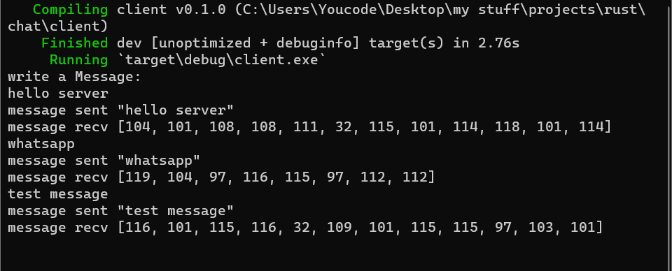
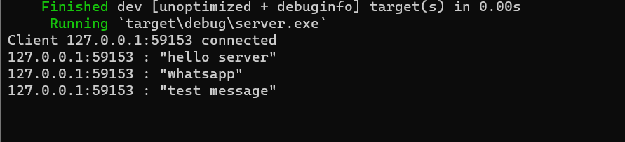

# rust-cli-chat-application
Simple real time client-server cli chat application with rust.

## installation 
```
git clone https://github.com/alaeessaki/rust-cli-chat-application
cd ./server/
sudo cargo run

cd ./client/
sudo cargo run
```

## Usage



